# ClassHub System Improvement Plan

This document outlines the comprehensive plan to address architectural concerns and improve the overall system structure.

## Key Findings and Proposed Solutions

1. **Database Scalability:**
   * **Finding:** SQLite usage limits scalability and concurrency.
   * **Solution:** Migrate to a production-grade database like PostgreSQL. Introduce connection pooling and optimize queries.

2. **Connection Management:**
   * **Finding:** Inefficient connection handling.
   * **Solution:** Configure connection pool parameters (size, overflow) for PostgreSQL. Implement robust connection health checks.

3. **Error Handling:**
   * **Finding:** Overly broad exception handling and implementation detail leakage.
   * **Solution:** Refine exception hierarchy. Catch specific exceptions. Abstract database errors from higher layers.

4. **Security:**
   * **Finding:** No database encryption. Unsafe backup procedure.
   * **Solution:** Enable encryption at rest for the database. Use database-specific backup tools (e.g., `pg_dump`) for safe backups.

5. **Structural Issues:**
   * **Finding:** Tight coupling between `DatabaseManager` and repositories.
   * **Solution:** Introduce a dependency injection mechanism. Decouple `DatabaseManager` from concrete repository implementations.

6. **Directory Structure Issues:**
   * **Finding:** 
     - Duplicate directories (`src/academic_organizer` and `academic_organizer/src` contain overlapping content)
     - Excessive nesting in paths like `academic_organizer/src/academic_organizer/modules/course_manager/course_manager.py`
     - Large files (e.g., `file_organizer.py` over 500 lines)
   * **Solution:** 
     - Consolidate duplicate directories
     - Simplify directory structure
     - Refactor large files into smaller, focused modules

## Implementation Plan

### 1. Database Migration

**Phase 1: PostgreSQL Setup & New DatabaseManager**
* Install PostgreSQL server
* Create a new database for the application
* Create a new `PostgresDatabaseManager` class in `academic_organizer/src/database/pg_db_manager.py`
* Configure connection parameters in `config_manager.py`

**Phase 2: Schema and Data Migration**
* Use Alembic to generate migration script
* Adapt script for PostgreSQL compatibility
* Run migration script to create schema
* Develop and execute data migration script
* Verify data integrity

**Phase 3: Application Update**
* Modify `app_controller.py` to support both database managers
* Test application with PostgreSQL

### 2. Connection Management Optimization

* Configure SQLAlchemy connection pooling
* Implement connection health checks
* Implement retry logic with exponential backoff

### 3. Error Handling Refinement

* Define specific exception classes:
  - `DatabaseConnectionError`
  - `QueryError`
  - `DataValidationError`
  - `ConfigurationNotFoundError`
* Update error handling code
* Implement user-friendly error messages

### 4. Security Enhancements

* Configure encrypted connections
* Enable encryption at rest
* Implement secure backup strategy
* Review and fix SQL injection vulnerabilities
* Add input validation

### 5. Structural Refactoring

* Define abstract base class for `DatabaseManager`
* Update database manager implementations
* Implement dependency injection
* Update application components

### 6. Directory Consolidation

**Phase 1: Analysis and Preparation**
* Create backup of current codebase
* Analyze contents of both directories
* Identify duplicate and conflicting files

**Phase 2: File Organization**
* Move unique content from `src/academic_organizer` to `academic_organizer/src`
* Eliminate redundant nesting
* Split `file_organizer.py` into:
  - `file_storage.py`: Storage and retrieval operations
  - `file_analyzer.py`: Content extraction and analysis
  - `file_metadata.py`: Metadata management
  - `file_organizer.py`: Core functionality

**Phase 3: Integration**
* Update import statements
* Update test files
* Remove redundant directory
* Verify functionality

## Implementation Timeline

1. Database Migration (Highest Priority)
2. Directory Consolidation
3. Connection Management
4. Error Handling
5. Security Enhancements
6. Structural Refactoring

## Mermaid Diagram

```mermaid
graph TD
    subgraph Database Migration
        A[Install PostgreSQL] --> B(Create Database)
        B --> C(Create PostgresDatabaseManager)
        C --> D(Configure Connection)
        D --> E(Generate Migration Script)
        E --> F(Adapt Script for PostgreSQL)
        F --> G(Run Migration Script)
        G --> H(Develop Data Migration Script)
        H --> I(Execute Data Migration)
        I --> J(Verify Data Integrity)
        J --> K(Update Application to use PostgreSQL)
    end

    subgraph Connection Management
        L[Configure Connection Pooling] --> M(Implement Health Checks)
        M --> N(Implement Retry Logic)
    end

    subgraph Error Handling
        O[Define Specific Exceptions] --> P(Modify Code to Raise/Catch)
        P --> Q(Update Error Handler Decorator)
        Q --> R(User-Friendly Error Messages)
    end

    subgraph Security Enhancements
        S[Configure Encrypted Connections] --> T(Enable Encryption at Rest)
        T --> U(Implement Secure Backup)
        U --> V(Review for SQL Injection)
        V --> W(Add Input Validation)
    end

    subgraph Structural Refactoring
        X[Define Abstract Base Class] --> Y(Modify DatabaseManagers)
        Y --> Z(Implement Dependency Injection)
        Z --> AA(Update Application)
    end

    subgraph Directory Consolidation
        BB[Analyze Directory Contents] --> CC(Identify Duplicates)
        CC --> DD(Merge Contents)
        DD --> EE(Update Imports)
        EE --> FF(Remove Redundant Directory)
    end
```

